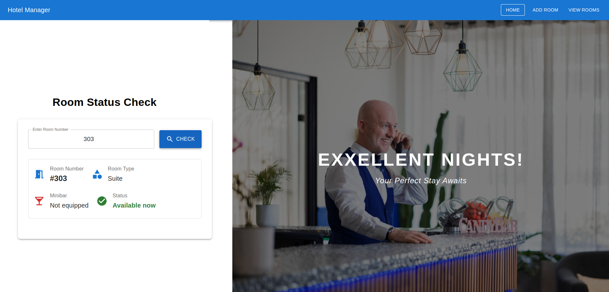
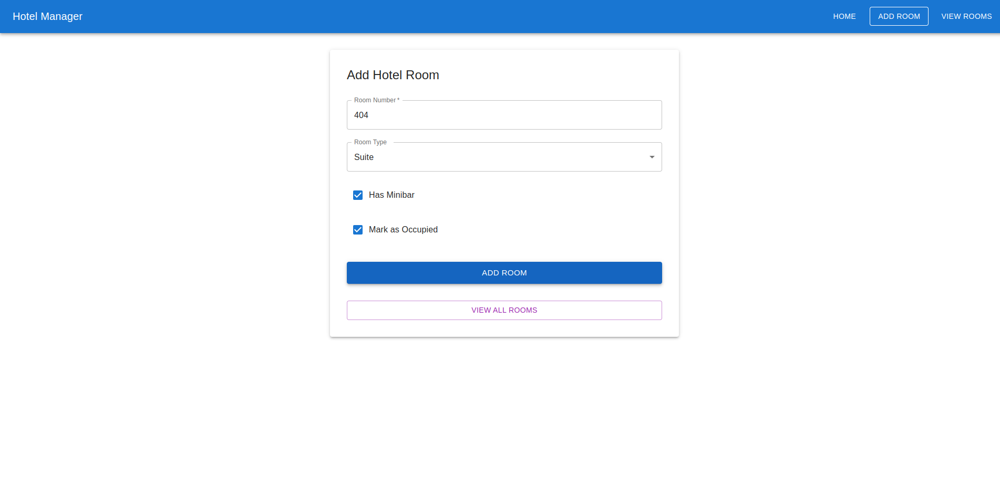
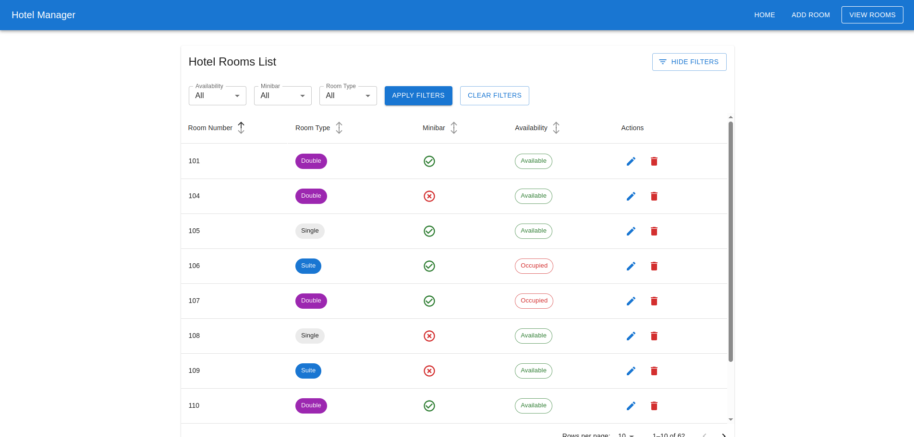
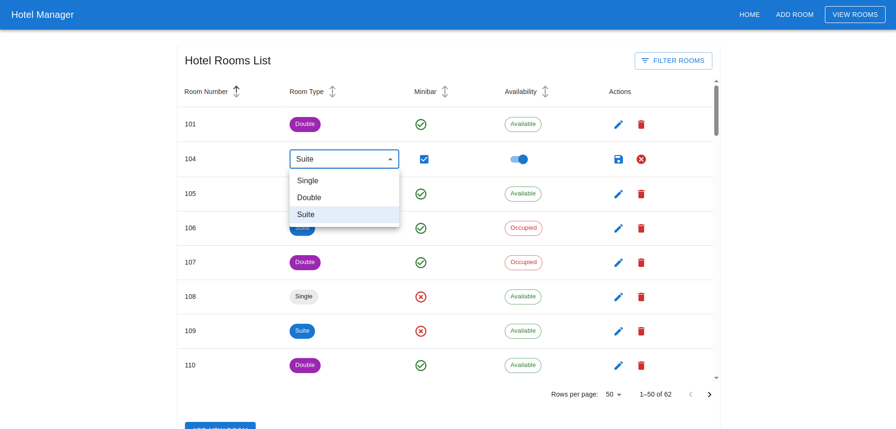

# Hotelmanager Project

**Hotelmanager** is an application to manage the hotel "eXXellent Nights!". It allows retrieving and modifying hotel room information through a database and an accessible REST API.

---

## 📚 Project Structure

```
.
├── devtools/               # Scripts, images, HTTP requests, etc.
├── hotelmanager-frontend/   # Frontend project (React)
├── hotelmanager-system/     # Backend project (Spring Boot + PostgreSQL)
```

---

## 🚀 Technologies Used

- **Frontend**: React, Material UI
- **Backend**: Spring Boot (Java)
- **Database**: PostgreSQL

---

## 📦 Features

- **Data Persistence**: All hotel room data is stored in a PostgreSQL database (can be in-memory or persistent).
- **Initial Data**: On application startup, three hotel rooms are created:
  - A **double room** with a minibar.
  - A **single room** with a minibar.
  - A **suite** without a minibar.
- **REST API Endpoints**:
  - Retrieve a hotel room by room number.
  - Add a new hotel room.
  - Edit a hotel room (e.g., add a minibar).
  - Delete a hotel room.
  - List all hotel rooms.
  - Filter hotel rooms (e.g., by availability or features).

---

## 🛠️ How to Run

### Backend (Spring Boot)

1. Navigate to `hotelmanager-system/`.
2. Build and run the project:
   ```bash
   ./mvnw spring-boot:run
   ```
3. The backend will start on `http://localhost:8080`.

Database configuration can be modified in `application.properties`.

### Frontend (React)

1. Navigate to `hotelmanager-frontend/`.
2. Install dependencies:
   ```bash
   npm install
   ```
3. Start the development server:
   ```bash
   npm start
   ```
4. The frontend will start on `http://localhost:3000`.

---

## 🗄️ Database

The SQL file `devtools/DB/DB_hotelmanager.sql` can be used to initialize the database if needed.

---

## 📄 API Documentation

You can find example HTTP requests for the API in `devtools/scripts/hotelmanager-httprequests-json.yaml`, compatible with Postman.

---

## 🧠 Development Notes

- Code is documented where necessary to ease future maintenance.
- Decisions taken during development (like initial data setup, project structure, etc.) are documented directly in the code comments.
- The project is designed for easy handover and extension by new developers.

---

## 🖼️ Screenshots

## 🖼️ Screenshots


### Home Page




### Add Room



### View Rooms





---

## 📬 Contact

For any inquiries or contributions, feel free to open an issue or pull request!
